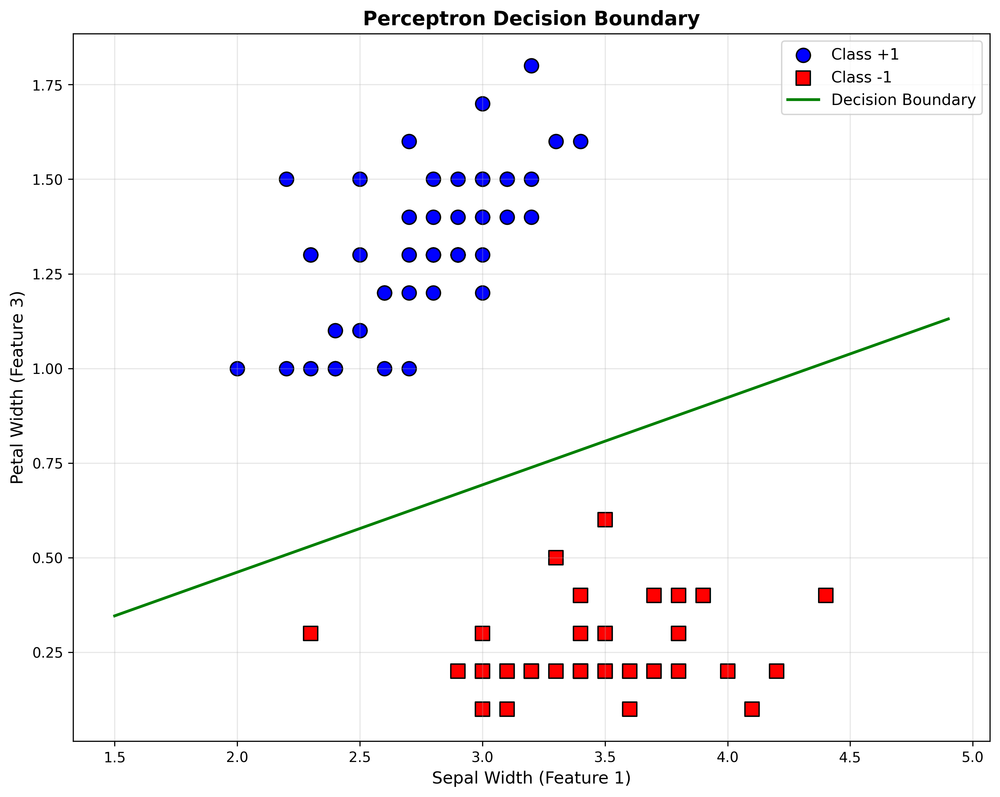
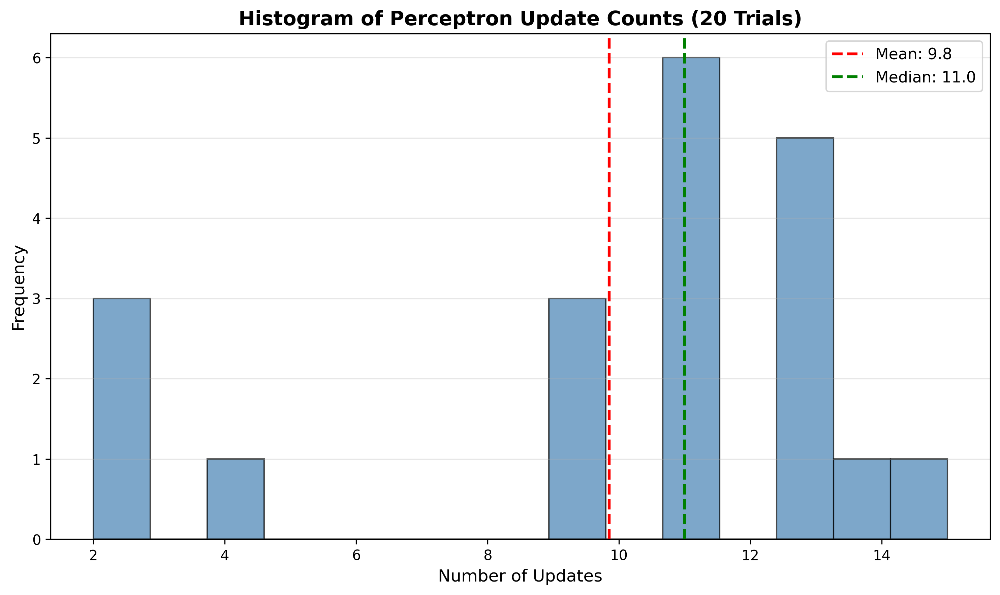

# HW 7 Problem 7: Binary Perceptron

## Part (a): Code for Two Functions

**Function 1:** Returns the label for a data point: `sign(w·x + b)`

```python
def predict(w, b, x):
    return np.sign(np.dot(w, x) + b)
```

**Function 2:** Trains a linear classifier using the Perceptron algorithm with random permutation of data points.

```python
def perceptron_train(X, y, max_iter=1000):
    n, d = X.shape
    w = np.zeros(d)
    b = 0.0
    
    for iteration in range(max_iter):
        indices = np.random.permutation(n)
        mistakes = 0
        
        for idx in indices:
            x_i = X[idx]
            y_i = y[idx]
            
            if y_i * (np.dot(w, x_i) + b) <= 0:
                w = w + y_i * x_i
                b = b + y_i
                mistakes += 1
        
        if mistakes == 0:
            break
    
    return w, b
```

## Part (b): Load Iris Data

Loaded Iris dataset using `datasets.load_iris()`. Restricted to features 1 and 3 (sepal width and petal width) and labels 0 and 1. Recoded label 0 as -1.

## Part (c): Decision Boundary Plot

Plot shows data points with different colors for each label (blue for +1, red for -1) and the resulting linear decision boundary (green line). The Perceptron successfully separates the two classes.



## Part (d): Histogram of Update Counts

Ran the algorithm 20 times and tracked the number of updates for each run. The histogram shows the distribution of update counts across trials, with mean and median indicated by dashed lines.


