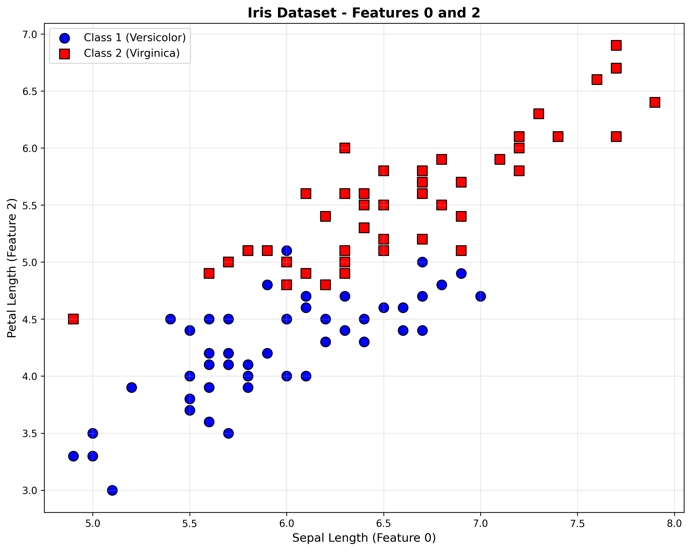
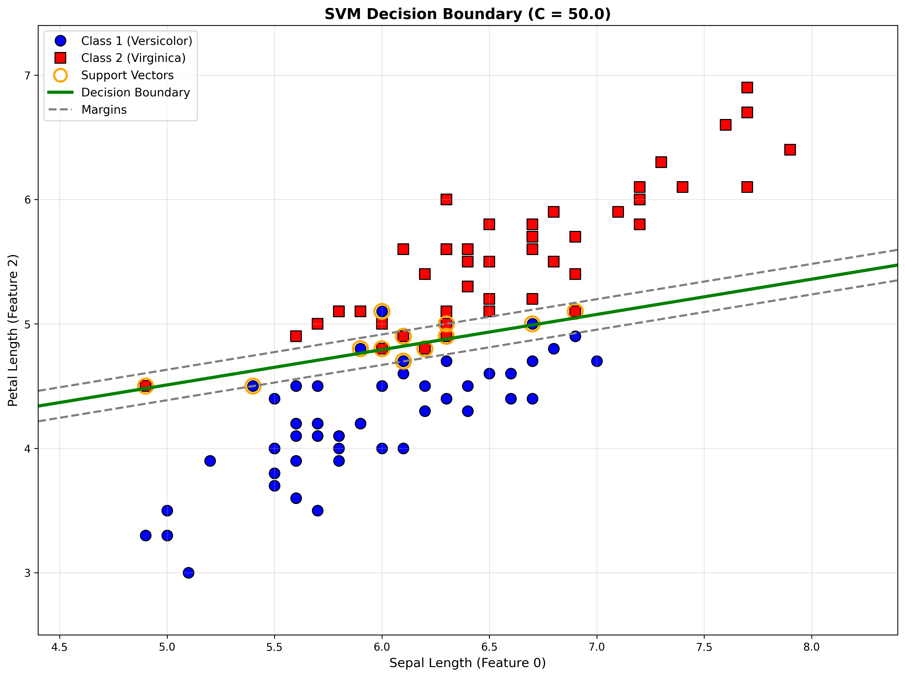

# HW 7 Problem 8: Support Vector Machine

## Part (a): Is this data linearly separable?

**Answer:** No, the data is NOT perfectly linearly separable. Based on visual inspection of the scatter plot, the two classes (Versicolor and Virginica) have overlapping regions, indicating that no single linear boundary can perfectly separate them without misclassifying some points.

## Part (b): SVM with Different C Values

Trained SVM with `kernel='linear'` for 11 different values of C:

| C        | Training Error | Num Support Vectors |
|----------|----------------|---------------------|
| 0.0010   | 0.0400         | 52                  |
| 0.0100   | 0.0400         | 48                  |
| 0.1000   | 0.0400         | 40                  |
| 0.5000   | 0.0400         | 37                  |
| 1.0000   | 0.0400         | 36                  |
| 5.0000   | 0.0400         | 34                  |
| 10.0000  | 0.0400         | 34                  |
| 50.0000  | 0.0400         | 34                  |
| 100.0000 | 0.0400         | 34                  |
| 500.0000 | 0.0400         | 34                  |
| 1000.0000| 0.0400         | 34                  |

**Observations:**
- All C values achieve the same training error (4% or 4 misclassified points)
- Larger C values result in fewer support vectors (more aggressive fitting)
- The number of support vectors stabilizes at 34 for C ≥ 5.0

## Part (c): Best C Value and Decision Boundary

**Best C value:** 0.001 (or any value, since all have equal training error; choosing smallest C for better generalization)

The plot shows:
- Blue circles: Class 1 (Versicolor)
- Red squares: Class 2 (Virginica)  
- Green solid line: Decision boundary
- Gray dashed lines: Margin boundaries
- Orange circles: Support vectors

The SVM finds the maximum-margin linear separator, with support vectors lying on or within the margin boundaries.

